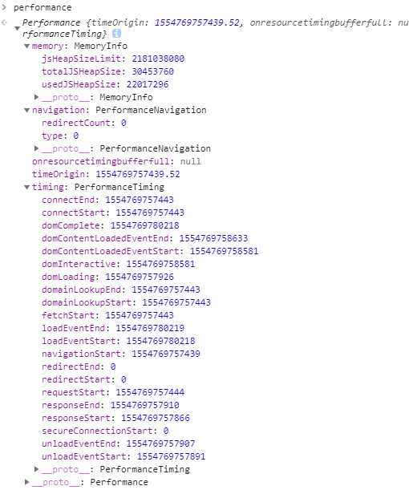

# 前端性能监控

> 通过以下方法来探测和兼容 performance

```js
var performance =
  window.performance || window.msPerformance || window.webkitPerformance
if (performance) {
  // you code ...
}
```

## 下图为在控制台打印的 performance 对象



## performance 对象属性解读

1. performance.memory

   > 显示内存占用情况

   - usedJSHeapSize
     > 内存大小限制
   - totalJSHeapSize
     > 可使用的内存
   - jsHeapSizeLimit
     > js 对象占用的内存数

2. performance.navigation

   > 显示页面的来源信息

   - redirectCount
     > 如果有重定向的话，页面通过几次重定向跳转而来，默认为 0
   - type

     > 表示页面的打开方式

     - 0 TYPE_NAVIGATENEXT
       > 正常进入页面(非刷新、非重定向)
     - 1 TYPE_RELOAD
       > 通过 window.location.reload()刷新的页面
     - 2 TYPE_BACK_FORWARD
       > 浏览器前进后退按钮进入的页面
     - 255 TYPE_UNDEFINED
       > 非以上方式进入的页面

3. performance.onresourcetimingbufferfull

   > 属性是一个在 resourcetimingbufferfull 事件触发时会被调用的 event handler 。它的值是一个手动设置的回调函数，这个回调函数会在浏览器的资源时间性能缓冲区满时执行

4. performance.timeOrigin

   > 是一系列时间点的基准点，精确到万分之一毫秒

5. performance.timing

   > 是一系列关键时间点，它包含了网络、解析等一系列的时间数据

   - navigationStart
     > 同一个浏览器上一个页面卸载(unload)结束时的时间戳。如果没有上一个页面，这个值会和 fetchStart 相同
   - unloadEventStart
     > 上一个页面 unload 事件抛出时的时间戳。如果没有上一个页面，这个值会返回 0
   - unloadEventEnd
     > 和 unloadEventStart 相对应，unload 事件处理完成时的时间戳。如果没有上一个页面,这个值会返回 0
   - redirectStart
     > 第一个 HTTP 重定向开始时的时间戳。如果没有重定向，或者重定向中的一个不同源，这个值会返回 0
   - redirectEnd
     > 最后一个 HTTP 重定向完成时（也就是说是 HTTP 响应的最后一个比特直接被收到的时间）的时间戳，如果没有重定向，或者重定向中的一个不同源，这个值会返回 0
   - fetchStart
     > 浏览器准备好使用 HTTP 请求来获取(fetch)文档的时间戳。这个时间点会在检查任何应用缓存之前
   - domainLookupStart
     > DNS 域名查询开始的 UNIX 时间戳。如果使用了持续连接(persistent connection)，或者这个信息存储到了缓存或者本地资源上，这个值将和 fetchStart 一致
   - domainLookupEnd
     > DNS 域名查询完成的时间.如果使用了本地缓存（即无 DNS 查询）或持久连接，则与 fetchStart 值相等
   - connectStart
     > HTTP（TCP） 域名查询结束的时间戳。如果使用了持续连接(persistent connection)，或者这个信息存储到了缓存或者本地资源上，这个值将和 fetchStart 一致
   - connectEnd
     > HTTP（TCP） 返回浏览器与服务器之间的连接建立时的时间戳。如果建立的是持久连接，则返回值等同于 fetchStart 属性的值。连接建立指的是所有握手和认证过程全部结束。
   - secureConnectionStart
     > HTTPS 返回浏览器与服务器开始安全链接的握手时的时间戳。如果当前网页不要求安全连接，则返回 0
   - requestStart
     > 返回浏览器向服务器发出 HTTP 请求时（或开始读取本地缓存时）的时间戳。
   - responseStart
     > 返回浏览器从服务器收到（或从本地缓存读取）第一个字节时的时间戳。
   - responseEnd
     > 返回浏览器从服务器收到（或从本地缓存读取，或从本地资源读取）最后一个字节时。（如果在此之前 HTTP 连接已经关闭，则返回关闭时）的时间戳。
   - domLoading
     > 当前网页 DOM 结构开始解析时（即 Document.readyState 属性变为“loading”、相应的 readystatechange 事件触发时）的时间戳
   - domInteractive
     > 当前网页 DOM 结构结束解析、开始加载内嵌资源时（即 Document.readyState 属性变为“interactive”、相应的 readystatechange 事件触发时）的时间戳
   - domContentLoadedEventStart
     > 当解析器发送 DOMContentLoaded 事件，即所有需要被执行的脚本已经被解析时的时间戳。
   - domComplete
     > 当前文档解析完成，即 Document.readyState 变为 'complete'且相对应的 readystatechange 被触发时的时间戳
   - loadEventStart
     > load 事件被发送时的时间戳。如果这个事件还未被发送，它的值将会是 0
   - loadEventEnd
     > 当 load 事件结束，即加载事件完成时的时间戳。如果这个事件还未被发送，或者尚未完成，它的值将会是 0.

6. 计算页面性能数据
   - 重定向耗时：redirectEnd - redirectStart
   - DNS 查询耗时 ：domainLookupEnd - domainLookupStart
   - TCP 链接耗时 ：connectEnd - connectStart
   - HTTP 请求耗时 ：responseEnd - responseStart
   - 解析 dom 树耗时 ： domComplete - domInteractive
   - 白屏时间 ：responseStart - navigationStart
   - DOMready 时间 ：domContentLoadedEventEnd - navigationStart
   - onload 时间：loadEventEnd - navigationStart，也即是 onload 回调函数执行的时间

## 优化

1. 重定向优化
   > 重定向的类型分三种，301（永久重定向），302（临时重定向），304（Not Modified）
   > 304 是用来优化缓存，非常有用，而前两种应该尽可能的避免，凡是遇到需要重定向跳转代码的代码，可以把重定向之后的地址直接写到前端的 html 或 JS 中，可以减少客户端与服务端的通信过程，节省重定向耗时。
2. DNS 优化

- 减少 DNS 的请求次数
  > 典型的一次 DNS 解析需要耗费 20-120 毫秒（移动端会更慢），减少 DNS 解析的次数是个很好的优化方式，尽量把各种资源放在一个 cdn 域名上。
- 进行 DNS 预获取（Prefetching ）
  > DNS Prefetching 是让具有此属性的域名不需要用户点击链接就在后台解析，而域名解析和内容载入是串行的网络操作，所以这个方式能减少用户的等待时间，提升用户体验 。新版的浏览器会对页面中和当前域名（正在浏览网页的域名）不在同一个域的域名进行预获取，并且缓存结果，这就是隐式的 DNS Prefetch。如果想对页面中没有出现的域进行预获取，那么就要使用显示的 DNS Prefetch 了
  ```html
  <html>
    <head>
      <title>腾讯网</title>
      <link rel="dns-prefetch" href="//mat1.gtimg.com" />
      <link rel="dns-prefetch" href="//inews.gtimg.com" />
      <link rel="dns-prefetch" href="//wx.qlogo.cn" />
      <link rel="dns-prefetch" href="//coral.qq.com" />
      <link rel="dns-prefetch" href="//pingjs.qq.com" />
    </head>
  </html>
  ```

3. TCP 请求优化
   > TCP 的优化大都在服务器端，前端能做的就是尽量减少 TCP 的请求数，也就是减少 HTTP 的请求数量。http 1.0 默认使用短连接，也是 TCP 的短连接，也就是客户端和服务端每进行一次 http 操作，就建立一次连接，任务结束就中断连接。这个过程中有 3 次 TCP 请求握手和 4 次 TCP 请求释放。减少 TCP 请求的方式有两种，一种是资源合并，对于页面内的图片、css 和 js 进行合并，减少请求量。另一种使用长链接，使用 http1.1，在 HTTP 的响应头会加上 Connection:keep-alive，当一个网页打开完成之后，连接不会马上关闭，再次访问这个服务时，会继续使用这个长连接。这样就大大减少了 TCP 的握手次数和释放次数。或者使用 Websocket 进行通信，全程只需要建立一次 TCP 链接
4. HTTP 请求优化
   > 使用内容分发网络（CDN）和减少请求。使用 CDN 可以减少网络的请求时延，CDN 的域名不要和主站的域名一样，这样会防止访问 CDN 时还携带主站 cookie 的问题，对于网络请求，可以使用 fetch 发送无 cookie 的请求，减少 http 包的大小。也可以使用本地缓存策略，尽量减少对服务器数据的重复获取。
5. 渲染优化
   > 在浏览器端的渲染过程，如大型框架，vue 和 react，它的模板其实都是在浏览器端进行渲染的，不是直出的 html，而是要走框架中相关的框架代码才能去渲染出页面，这个渲染过程对于首屏就有较大的损耗，白屏的时间会有所增加。在必要的情况下可以在服务端进行整个 html 的渲染，从而将整个 html 直出到我们的浏览器端，而非在浏览器端进行渲染
   > 还有一个问题就是，在默认情况下，JavaScript 执行会“阻止解析器”，当浏览器遇到一个 script 外链标记时，DOM 构建将暂停，会将控制权移交给 JavaScript 运行时，等脚本下载执行完毕，然后再继续构建 DOM。而且内联脚本始终会阻止解析器，除非编写额外代码来推迟它们的执行。我们可以把 script 外链加入到页面底部，也可以使用 defer 或 async 延迟执行。defer 和 async 的区别就是 defer 是有序的，代码的执行按在 html 中的先后顺序，而 async 是无序的，只要下载完毕就会立即执行。或者使用异步的编程方法，比如 settimeout，也可以使用多线 webworker，它们不会阻碍 DOM 的渲染。
   ```html
   <script async type="text/javascript" src="app1.js"></script>
   <script defer type="text/javascript" src="app2.js"></script>
   ```

## 资源性能 API

> performance.getEntries()方法，包含了所有静态资源的数组列表；每一项是一个请求的相关参数有 name，type，时间等等
> 与 performance.timing 对比： 没有与 DOM 相关的属性，新增了 name、entryType、initiatorType 和 duration 四个属性

- name
  > 资源名称，也是资源的绝对路径，可以通过 performance.getEntriesByName（name 属性的值），来获取这个资源加载的具体属性
- entryType
  > 表示：资源类型 "resource"，还有“navigation”, “mark”, 和 “measure”另外 3 种
  - mark
    > 该类型对象：performanceMark
    > 通过 mark()方法添加到数组中的对象
  - measure
    > 该类型对象：performanceMeasure
    > 通过 measure()方法添加到数组中的对象
  - resource
    > 该类型对象：performanceResourceTiming
    > 所有资源的加载时间
  - navigation
    > 该类型对象：performanceNavigationTiming
    > 导航相关信息，chrome 与 Opera 不支持
- initiatorType
  > 请求来源 "link"，即表示<link> 标签，还有“script”即 <script>，“img”即标签，“css”比如 background 的 url 方式加载资源以及“redirect”即重定向 等
- duration
  > 加载时间，毫秒

## performance 方法集合

- performance.now()
  > 返回一个当前页面执行的时间的时间戳，用来精确计算程序执行时间
  > 通过这个方法，我们可以用来测试某一段代码执行了多少时间

```js
let t0 = window.performance.now()
doSomething()
let t1 = window.performance.now()
console.log('doSomething函数执行了' + (t1 - t0) + '毫秒.')
```

- performance.mark()
  > mark 方法用来自定义添加标记时间

```js
var nameStart = 'markStart'
var nameEnd = 'markEnd'
// 函数执行前做个标记
window.performance.mark(nameStart)
for (var i = 0; i < n; i++) {
  doSomething
}
// 函数执行后再做个标记
window.performance.mark(nameEnd)
// 然后测量这个两个标记间的时间距离，并保存起来
var name = 'myMeasure'
window.performance.measure(name, nameStart, nameEnd)
```

- Performance.clearMeasures()
  > 从浏览器的性能输入缓冲区中移除自定义添加的 measure
- Performance.getEntriesByName()
  > 返回一个 PerformanceEntry 对象的列表，基于给定的 name 和 entry type
- Performance.getEntriesByType()
  > 返回一个 PerformanceEntry 对象的列表，基于给定的 entry type
- Performance.measure()
  > 在浏览器的指定 start mark 和 end mark 间的性能输入缓冲区中创建一个指定名称的时间戳
- Performance.toJSON()
  > 是一个 JSON 格式转化器，返回 Performance 对象的 JSON 对象
